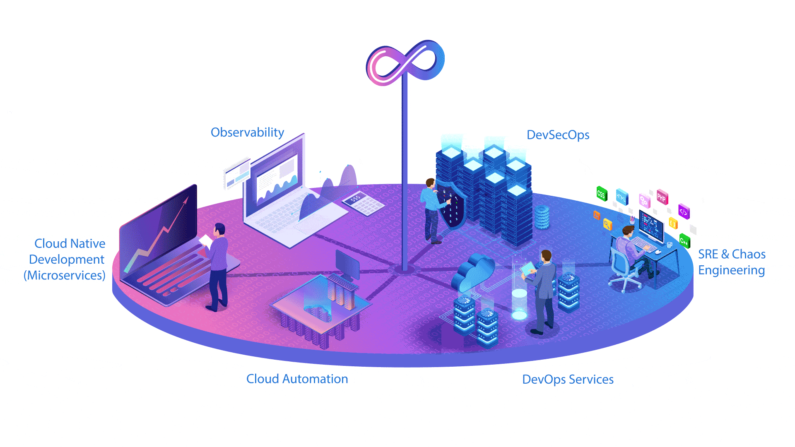

  
  

### 
I'm Samet, a full-time AWS & DevOps Engineer 
  
  

- 🔭 I’m currently working on Docker  
  

- 🌱 I’m currently learning Hyperledger and Kubernetes  
  

   

## DevOps  
  

   

  
  
  
  
  
  
  
  
  
  
  
  
  
  
  

  

   

<table><tr><td valign="top" width="33%">

### Frontend  

  
  
  
  
  
  
  
  
  
  
  
  
  
  

</td><td valign="top" width="33%">

### Backend  

  
  
  
  
  
  
  
  
  
  
  
  
  
  
  
  
  
  

</td><td valign="top" width="33%">

### IOT  

  
  
  

</td></tr></table>  

   

## Connect with me  

  

  
  

   

## Github Stats  

  

   

  

   

  

 

----

Generated using <a href="https://profilinator.rishav.dev/" target="_blank">Github Profilinator</a>

